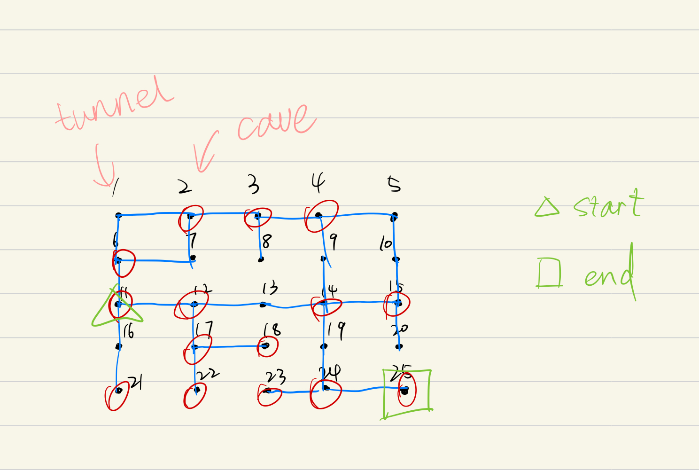
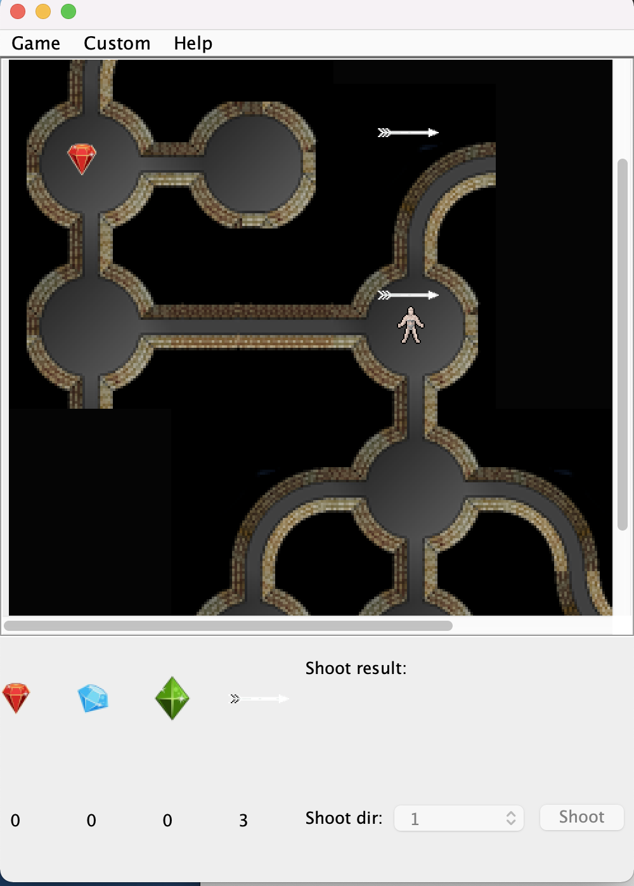
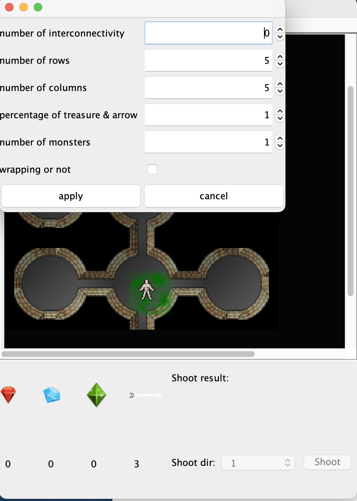
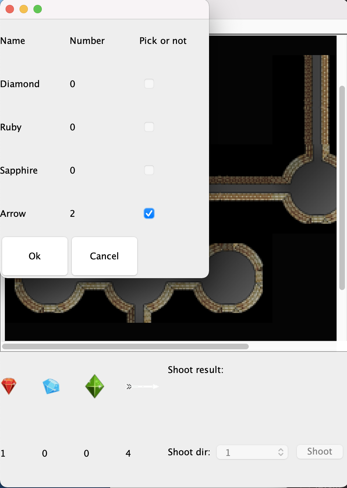
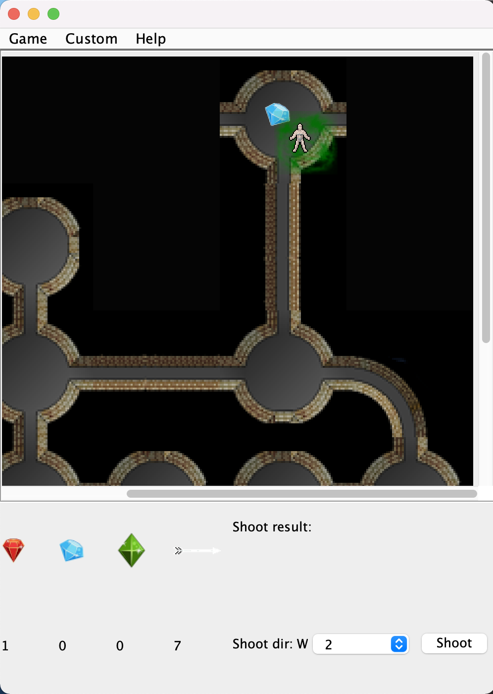
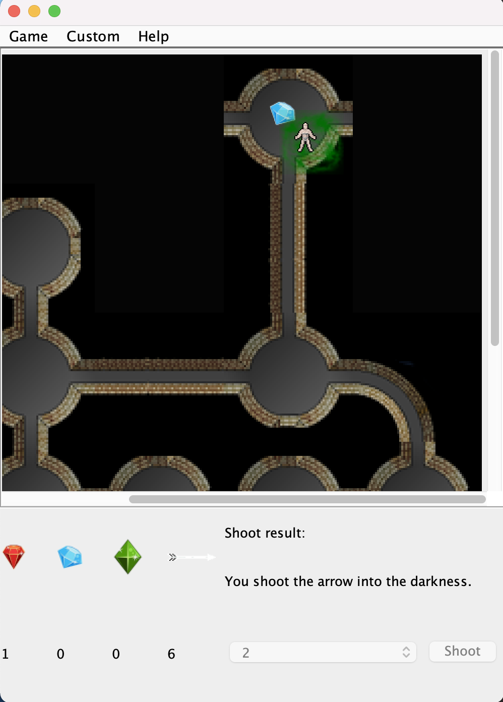

## 1.About

- This is a model that could generate Dungeons randomly. A Dungeon is made of different nodes in a
  2-D grid. Each node could be a cave or a tunnel. If the node has 1, 3, 4 paths could come to it,
  it is a cave. If the node has exactly 2 paths come to it, it is a tunnel. The caves can store
  treasures while the tunnel can not. Every node will have at least one path to other node. The user
  can specify a interconnectivity which will increase paths between two nodes. A player can enter
  the Dungeon and can move in the Dungeon and pickup treasures on his current locations. A Dungeon
  can have some Otyughs and the number of Otyughs is specified by a user input. There also some
  arrows in the Dungeon and can be picked up by a player. The showing frequency of arrows is the
  same as the treasure. However, arrows also can be found in a tunnel.
- A player can move in the Dungeon according to the prompt. A player can explore in the Dungeon and
  pickup treasures and arrows. A player will smell a danger smell when he is about to meet an
  Otyugh. He could use the arrows he found to try to kill the Otyugh. The arrow can travel through
  tunnels freely but can only travel through caves in the opposite direction that the arrow comes. A
  healthy Otyugh will need 2 shoots to kill them. If a player encountered a healthy Otyugh, he will
  be eaten and lose the match. If he encountered a wounded Otyugh, the player will a 50% chance to
  escape. If the player have reached the end point of the Dungeon and is not eaten by the Otyugh, he
  win the match. Otherwise, he loses it.
- The game provides a Gui that a user can use a mouse or a keyboard to move in the dungeon. By using 
a keyboard a user also can shoot otyughs and pick up treasures and arrows.


(1) An example of Dungeon.


(2) An example of player goes through the Dungeon.


(3) The screen shot of the game.

## 2. Features

- The dungeon is represented on a 2-D grid.
- Each node on the Dungeon will have at least one path to other nodes. A user can give a
  command-line argument to increase the connectivity between two nodes.
- A connectivity of 0 means that one can the node on the Dungeon will have exactly one path to other
  node.
- A user can specify whether the Dungeon is wrapping or not. A wrapping dungeon means that a player
  can go from the border nodes to opposite nodes while on a non-wrapping Dungeon not.
- A player can go from one node to other node by at most 4 directions. Specifically, North, East,
  South, West.
- A node has exactly 2 paths come to it is a tunnel.
- A node has 1 or 3 or 4 paths come to it is a cave.
- Two caves are randomly selected to be the start and end of the Dungeon. The path between those two
  nodes will be at least 5.
- A player can specify an integer to specify how many caves will be assigned treasures.
- A player can enter the Dungeon can move in the Dungeon and picks up treasures on his current
  locations.
- The dungeon can have arrows and Otyughs in it.
- A player can use arrows to kill Otyughs.
- A player will smell a dangerous smell when he is near Otyughs.
- A player can escape when there is only one unhealthy Otyugh.
- A player can use a mouse or a keyboard to move in the dungeon.
- A player can use a keyboard to shoot the Otyughs.
- A player can use a keyboard to pick up treasures.
- Treasures in the dungeon will be display on the screen.
- Treasurea that a player have will be display in the screen as well.
- The idication of smell will display on the screen.


An example of wrapping Dungeon.

## 3. How to Run

- Use text-based game.

(1) Open the CMD on Windows or Terminal on Linux and Mac.

(2) Go to the place you store Project5.jar(in the res dir by default) using cd or dir.

(3) Type this command and with 6 arguments follow it.

```
Java -jar Project3.jar
```

- arg[0]: The number of rows in the Dungeon, please input an integer that greater than 5.
- arg[1]: The number of columns in the Dungeon, please input an integer that greater than 5.
- arg[2]: The connectivity of the Dungeon. Please input an integer that greater than 0.
- arg[3]: To determine whether a Dungeon is wrapped or not. Please input a word `true` to represent
  that you want a wrapping dungeon. and ``false`` to represent that you don't want a wrapping
  dungeon.
- args[4]: To specify how many caves will be assigned treasures. Please input an integer that
  greater than 0.
- args[5]: To specify how many Otyughs will be assigned to the Dungeon.

An example of creating a 5 * 5 Dungeon with a connectivity 0 ang border not wrapped. Twenty percent
caves will be randomly assigned a treasure and 5 Otyughs will be assigned to the Dungeon: 

```
Java -jar Project5.jar 5 5 0 false 20 5
```

- Use GUI-based game
  (1) follow the step(1) (2) above.
  (2) Type the command without any arguments.
```
Java -jar Project5.jar
```
## 4. How to use

(1) Follow step 3 above.

(2) A Dungeon interface can be used to generate Dungeon according to user's requirements. An example
of creating a Dungeon is:

```Java
Dungeon dungeon=new DungeonImpl(rowNum,colNum,interconnectivity,isWrap,percentage, otyNum, true);
```

The last argument means that the instance will not be used for testing. If you use this instance to
test, you need to input ``false``.

(3) A player interface can move and collect treasures on the Dungeon. An example of creating a
player is:

```Java
Player player=new PlayerImpl();
```

(4) A GameModel interface is used to compose functions of Dungeon interface and
Player interface. One can use it like this:
```Java
GameModel gameModel = new GameModelImpl(rowNum,colNum,interconnectivity,isWrap,percentage, otyNum, true);
```

(5) A Controller interface is used to get user input and interact with GameModel interface. A Controller interface 
can be used like this: 
```Java
Readable reader = new InputStreamReader(in);
Controller controller = new ControllerImpl(reader, out);
```

(6) A GuiController interface is used to interact with user via mouse and keyboard. It can be used like this:
```Java
GameModel model = new GameModelImpl(5, 5, 0, false, 20, 5, true);
      GuiController controller = new GuiControllerImpl(model);
```
## 5. Example

The Driver class is composed of the concrete class of the GameModel interface and the concrete class
of Controller interface. 
- The `res/wins.txt` shows a player explore in a Dungeon and finlly win. 

- The `res/lose.txt` shows a player explore in the Dungeon and finally 
lose the match. 

- The `res/UIDesign.pdf` shows the UI of the game.

- A user can set custom parameters of the dungeon. By click
`Custom -> Custom Setting`
This is the screenshot of setting dungeon parameters by user.


- A user can pick up treasures or arrow using the P key on the keyboard.
In a dungeon that has treasures or arrows, a player first should press K key,
then a window will pop up to show what objects and their number in the current location,
a player can then use a mouse to select which object he wants to pick by clicking the check box.
This is the screenshoot of pick up.


- A user can restart or exit the game by click `Game -> Restart game/ Exit game`
  - A user can shoot a otyugh when he detects a smell. To shoot, firstly, player should press `x` on
  the keyboard to represent that he wants to shoot, when he presses this key, he can move util he press `q` to
  quit shoot or he finishes shooting. Secondly, he could use `W`, `A`, `S`, `D` to represents the shoot
  direction. He should provide a valid direction or the shoot function will not activated. After the shoot function is activated 
  and the  message board shows the direction the player choose, a player then can choose the distance that
  he wants to shoot in that direction. Then he can press shoot button and the shoot result will be shown on the screen.
  axa

This is a picture shows that the shoot function is activated.


This is a picture shows the shoot result.


## 6.Design changes

(1) Assigned treasures to caves randomly.

(2) Changed data type from integer to Location of Graph and UF.

(3) Using BFS to achieve start-end path constraints.


(5) Add Otyughs to Dungeon.

(6) Add findAdjacentSpeDis() method in the Dungeon interface to find adjacent nodes from one specific node with specific distance.

(7) Add arrows to Dungeon.

(8) Add GameModel concrete class and IGameModel interface.

(9) Add slayOty to IGameModel interface.

(10)  Add getDangerType() method in the IGameModel interface.

(11) Add isWin() method to the IGameModel interface to determine whether a player has win when he move to a new location.

(12) Add isEaten() method to the IGameModel interface to determine whether the player will be eaten by a otyugh in the current location.

(13) Add some functions in the GameModel.

(14) Add a GuiController to control the flow of the GUI-based game.

(15) Add few views to make the game graphics.

## 7.Limitations

- The model can not count the number of each kinds of treasures.
- The model can only assigned treasures to caves according to their place instead of choosing the
  place randomly.
- Pick up function is not that user friendly, may be could use some concise method to replace the frame.
- Pick up can not choose the number of each item that a player wants to pick.

## 8. Assumptions

(1) A player can only get one piece of Treasure at a time.

## 9.Citations

(1)BFS DFS

<cite>Sedgewick, R. (2010). Graphs. In Algorithms in Java. essay, Addison-Wesley.</cite>

(2) Adjacency List

<cite>https://www.sanfoundry.com/java-program-implement-adjacency-list/

(3) How to resize a BufferImage
<cite>https://www.baeldung.com/java-resize-image</cite>

(4) Remove the gap of the GridLayout
<cite>https://stackoverflow.com/questions/65112002/too-large-vertical-gaps-on-swing-gridlayout</cite>
