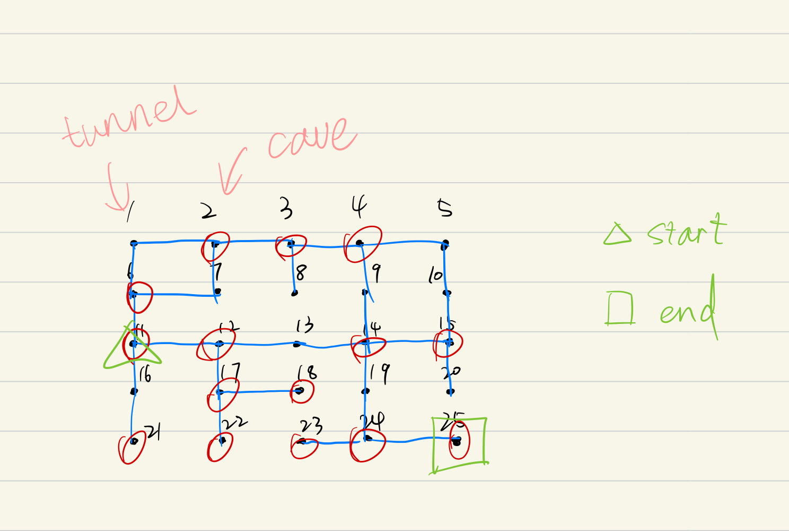
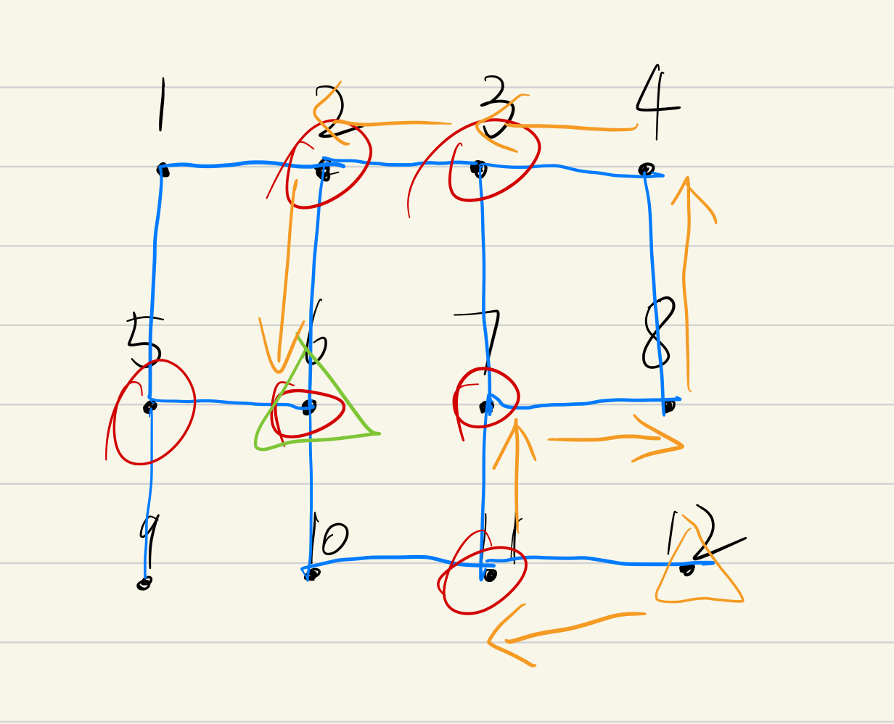
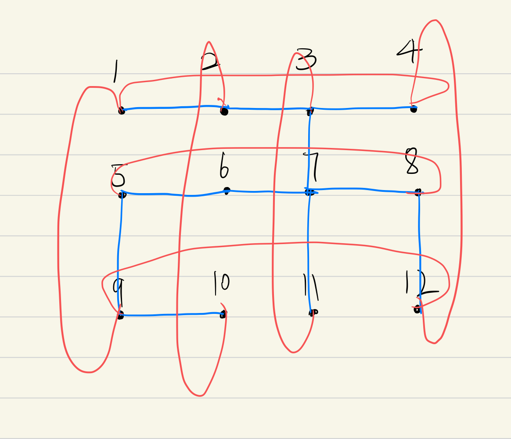

## 1.About
This is a model that could generate Dungeons randomly.
A Dungeon is made of different nodes in a 2-D grid.
Each node could be a cave or a tunnel. If the node has 
1, 3, 4 paths could come to it, it is a cave. If the 
node has exactly 2 paths come to it, it is a tunnel.
The caves can store treasures while the tunnel can not.
Every node will have at least one path to other node. The user 
can specify a interconnectivity which will increase paths 
between two nodes. A player can enter the Dungeon and can
move in the Dungeon and pickup treasures on his current
locations.


(1) An example of Dungeon.


(2) An example of player goes through the Dungeon.


## 2. Features
- The dungeon is represented on a 2-D grid.
- Each node on the Dungeon will have at least one path to other 
nodes. A user can give a command-line argument to increase the 
connectivity between two nodes.
- A connectivity of 0 means that one can the node on the Dungeon
will have exactly one path to other node.
- A user can specify whether the Dungeon is wrapping or not.
A wrapping dungeon means that a player can go from the border 
nodes to opposite nodes while on a non-wrapping Dungeon not.
- A player can go from one node to other node by at most 4 directions.
Specifically, North, East, South, West.
- A node has exactly 2 paths come to it is a tunnel.
- A node has 1 or 3 or 4 paths come to it is a cave.
- Two caves are randomly selected to be the start and end
of the Dungeon. The path between those two nodes will be at least 5.
- A player can specify an integer to specify how many caves will
be assigned treasures.
- A player can enter the Dungeon can move in the Dungeon and picks up
treasures on his current locations.



An example of wrapping Dungeon.

## 3. How to Run
(1) Open the CMD on Windows or Terminal on Linux and Mac.

(2) Go to the place you store Project3.jar using cd or dir.

(3) Type this command and with 5 arguments follow it.
```
Java -jar Project3.jar
```

- arg[0]: The number of rows in the Dungeon, please input an
integer that greater than 5.
- arg[1]: The number of columns in the Dungeon, please input an 
integer that greater than 5.
- arg[2]: The connectivity of the Dungeon. Please input an
integer that greater than 0.
- arg[3]: To determine whether a Dungeon is wrapped or not. Please
input a word `true` to represent that you want a wrapping dungeon.
and ``false`` to represent that you don't want a wrapping dungeon.
- args[4]: To specify how many caves will be assigned treasures. Please 
input an integer that greater than 0.

An example of creating a 5 * 5 Dungeon with a connectivity 0
ang border not wrapped. Twenty percent caves will be randomly 
assigned a treasure:

```
Java -jar Project3.jar 5 5 0 false 20
```

## 4. How to use
(1) Follow step 3 above.

(2) A Dungeon interface can be used to generate Dungeon
according to user's requirements. An example of creating a 
Dungeon is:
```Java
Dungeon dungeon = new DungeonImpl(rowNum, colNum, interconnectivity, isWrap, percentage, true);
```
The last argument means that the instance will not be used for testing. If you use
this instance to test, you need to input ``false``.

(3) A player interface can move and collect treasures on the 
Dungeon. An example of creating a player is:
```Java
Player player = new PlayerImpl();
```

## 5. Example
The Driver class shows an example of using DFS method to control 
a player moving on the dungeon and collect treasures. After every move
a information regarding the player and the current location will
be output.

## 6.Design changes
(1) Assigned treasures to caves randomly.
(2) Changed data type from integer to Location of Graph and UF.
(3) Using BFS to achieve start-end path constraints.
(4) Changed the adjacentList from ``Map<Integer, List<Integer>>`` to 
Map<Integer, List<Location>>

## 7.Limitations
- The model can not count the number of each kinds of 
treasures.
- The model can only assigned treasures to caves according to 
their place instead of choosing the place randomly.

## 8. Assumptions
(1) A player will collect all the treasures in his current location.

## 9.Citations
(1)BFS DFS

<cite>Sedgewick, R. (2010). Graphs. In Algorithms in Java. essay, Addison-Wesley.</cite>

(2) Adjacency List

<cite>https://www.sanfoundry.com/java-program-implement-adjacency-list/


